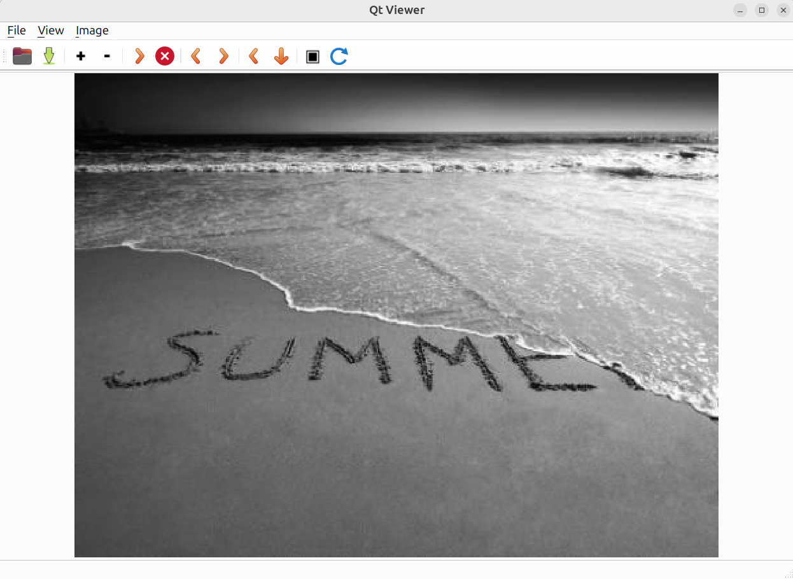

# Qt Viewer

A lightweight image viewer built with modern C++, Qt Widgets, and CMake.

## Screenshot

## Features

- Load and display images
- Zoom in/out
- Pan images
- Fit image to window
- Modern C++ architecture
- Cross-platform design

## Technologies

- C++17
- Qt 6
- CMake
- OpenCV (planned)
- OpenGL (planned)

## Project Structure

qt-viewer/
├── cmake/
├── docker/
├── docs/
├── include/
├── resources/
├── samples/
├── scripts/
├── src/
└── tests/

## Build

Coming soon.

## License

MIT License
